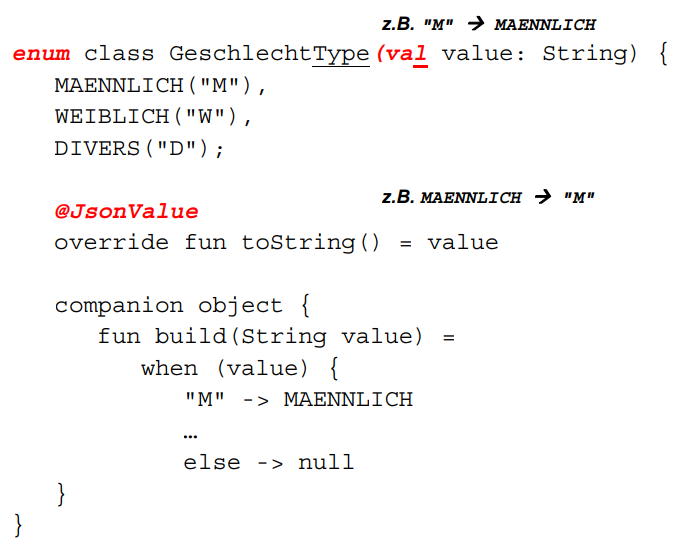
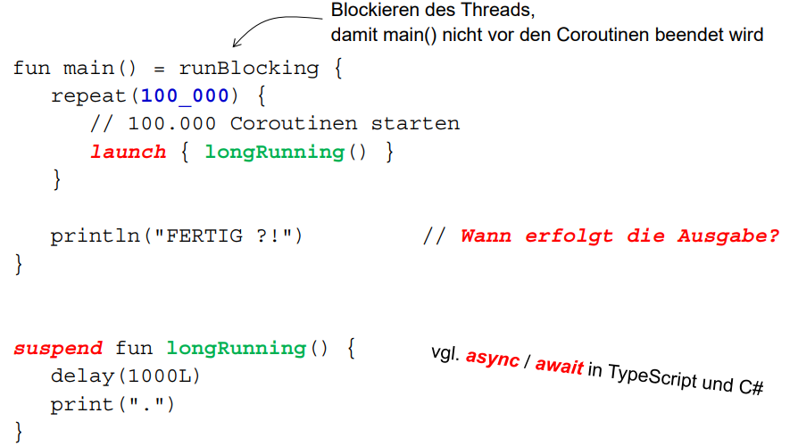
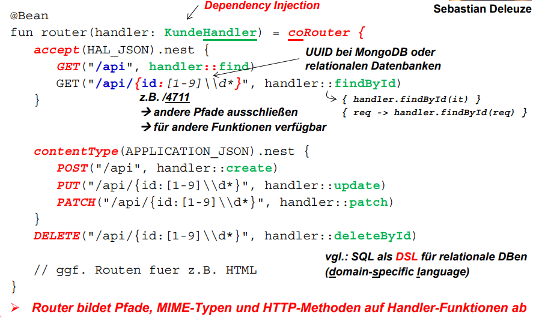

# RESTful Webservices und Reactive Programming

* Bei Rest werden die HTTP-Methoden verwendet um auf Ressourcen zuzgreifen

## Motivation

* Wie ewrden Schnittstellen angeboten so das alle Gräte zugreifen können oft wird dafür Rest gewählt

* Viele große Unternehmen nutzen Rest z.B Facebook, Google, Ebay, reddit

## REST im Überblick

* HTTP-Methoden auf CRUD und Sql abbilden

    * GET = Read = SELECT
    * POST = Read = INSERT
    * PUT/PATCH = Update = UPDATE
    * DELETE = Delete = DELETE

## URI Universal Ressource Identifier

* Eindeutige Bezeichnung für eine Ressource

* Bestandteile einer URI
    
    * Schena z.B http oder https
    * Rechnername oder IP Adresse
    * Port 
    * Pfad 

## Was ist REST

* REpresentional State Transfer

* Architekturstil aber kein Standard

* Verwendete Standards

    * URIs zur Identifikation von Ressourcen
    * Zugriff auf URIs mit den HTTP-Methoden
    * MIME Typen
    * JSON
    * ...

* Repräsentation von Objekten

    * Datenaustausch zwischen Client und Server
    * vor allem JSON und binäre Dateien (Bilder, Videos)

* Zusatandslose Kommunikation

## Zusammenspiel von Client und Server

* Der Client sendet im Request Header den MIME Typ mit welcher angibt in welchem Format er die Daten haben möchte. z.B accept = application/json

* Der Server sendet im Response Header den MIME Typ mit welcher angibt in welchem Format der Body ist. z.B. content-type = application/json

# JSON mit Jackson

## JSON im Überblick

* Java Script Object Notátion

* Es werden Objekte in JavaScript representiert 

* Als Austauschformat leichtgewichtiger als XML

* geschweifte Klammern für Datensätze

* eckige Klammern für, Listen, Array, Mengen ...

* überprüfen von JSON Datensätzen mit jsonlint.com

* hierachische Struktur, keime Rückwertsverweise möglich

## Jackson

* Konvertierung von JSON Objekten zu Kotlin Objektem und umgekehrt

* Jackson konvertiert erstmal alle Properties in Kotlin zu JSON und umgekehrt, wenn man nicht möchte das eine Property von Jackson konvertiert wird muss man diese mit @JsonIgnore annotieren. Convention over Configuration

* unterstützte Typen durch Jackson in Kotlin

    * String
    * int, Loong
    * (Float, Double) 
    * Boolean

* Abblidung von Enums: 

## MIME-Typen

* Mutlipurpose Internet Mail Extensions

* gibt an in welchem Format die Übertragen Daten habe

* BSP: application/json, text/plain, text/html, image/... , video/...

# Reactive Programming und Corotinen

## Reactive Manifesto

* Message Driven: Reaktion auf asynchron eingehende Nachrichten

* Elastic: Reaktion auf wechselnde Last d.h. Skalierbarkeit

* Resilient: Reaktion auf Ausfälle z.B durch Replikation

* Responsive: Reaktion auf Requests der Clients bei kurzer Antwort und hoher Verfügbarkeit

## Backpresure

* Wenn zu viele Request eingehen soll der Server mit dieser Last umgehen können

* dazu abonniert der Subscriber nur bis zu einer Obergrenze und der Publisher produziert nur bis zu einer Obergrenze 

* wenn zu viele Requests kommen werden diese Anfragen entweder zurückgewiesen oder noch besser auf andere Server weitergeleitet

## Reactive Streams

* entwickelt von Netflix, Oracle ,Red Hat, VMware Tanzu, Twitter, ..

* Ziel: everything is a stream and its observable

* 4 Interfaces für funktinalen Programmierstil 

* Umgesetzt z.B. in RxJava von Netflix oder Project Reactor von VMware Tanzu

## Coroutinen von Kotlin

* leichtgewichtige Threads in Kotlin

* Ziele: 

    * eine Funktion soll suspendierbar sein das heißt sie kann unterbrochen und später wierder fortgesetzt werden.
    * ohne Blockierung eines Threads bei Pausierung der Funktion
    * nich blockierender Code soll möglichst einfach sein

* Coroutinen laufen mit einem Pool von Threads

* In einem Thread können mehrere Coroutinen laufen

* Datentyp für Streams ist Flow

* Implementierung im Package kotlinx.coroutines

* Bsp: 

# Rest mit Spring WebFLux.fn

## Router für "Functional Enpoints"

* Router ist eine Single Expression Funcion die Funktion co Router wird zrückgegeben

* coRouter ist eine Higher Order Function(Ihm gefällt HOF ausgesprochen gut)

* co seht für Coroutinen, heißt ein Router ist eien Funktion von Spring die Coroutinen verwendet

* nach coRouter Lambda Ausdruck

* in co Router wird die Funktion accept aufgrufen auf dem Ergebniss dieser Funktion wird die Funktion .nest aufgerufen

* Semantik accept: der Server nimmt einen Request entgegen welcher den MIME Typ hal+json haben soll. (HAL_JSON wird statt Mime-Typ verwendet, Konstante besser als der String da Fehler in der Variablen leichter erkennbar sind ,eine falsche Konstante wird vom Compiler erkannt. Daher wenn Konstanten vorhanden diese auch verwenden.)

* in der Funktion nest wird die Funktion GET aufgerufen

* GET hier bewusst in Caps damit man Bezug zur HTTP-Methode versteht

* Semantik GET erstes mal: wenn ein get request mit basis Pfad /api eingeht und der Client hal+json möchte dann wird vom handler die find Funktion aufgerufen.

* Semantik GET zweites mal: wenn der Basispfas api/ID ist wird vom handler die Funktion findbyid aufgerufen, der Rest gleich wie beim ersten get request