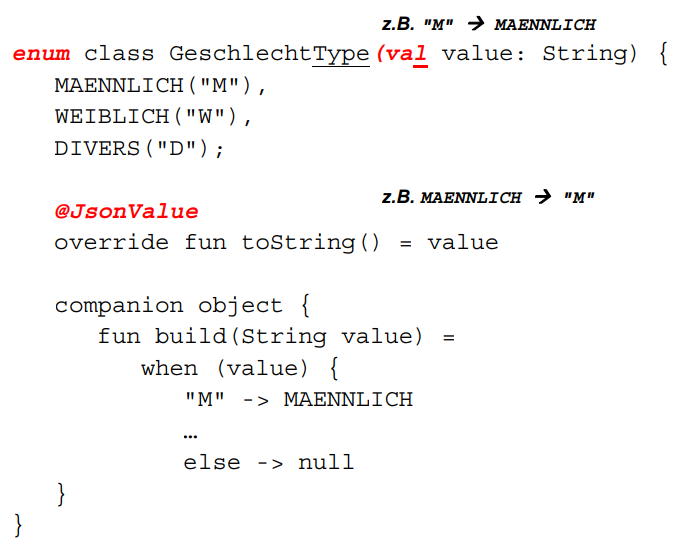
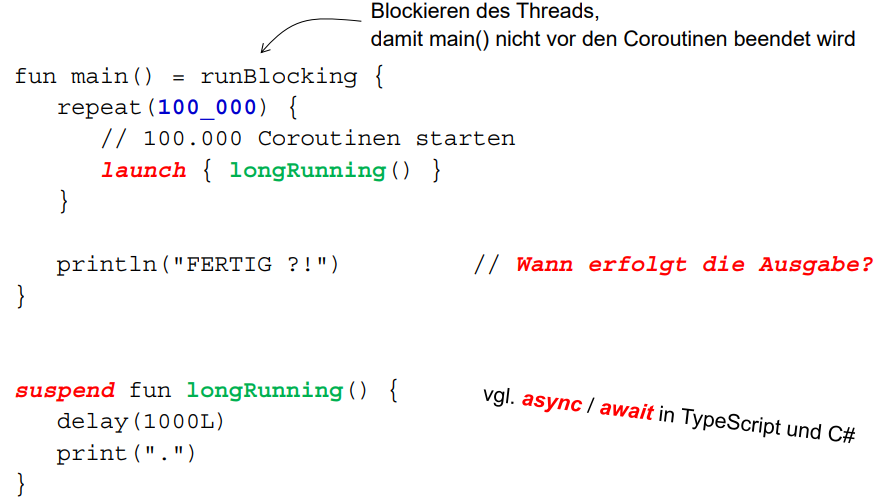
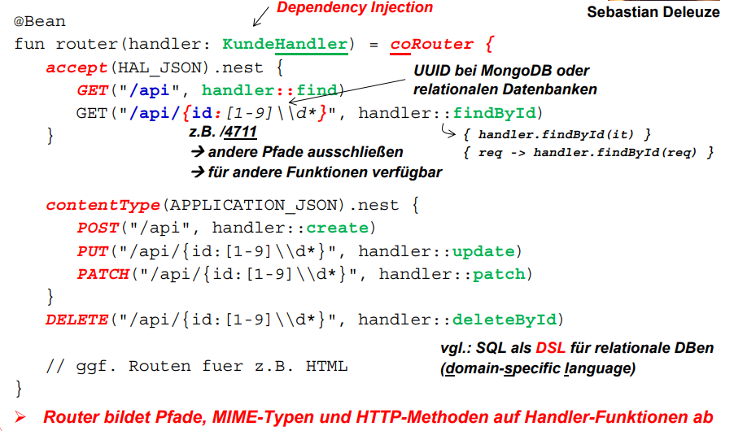
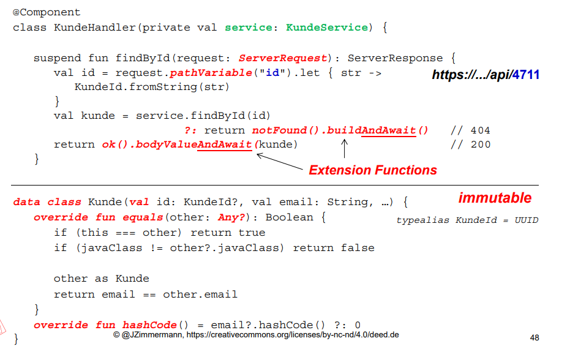
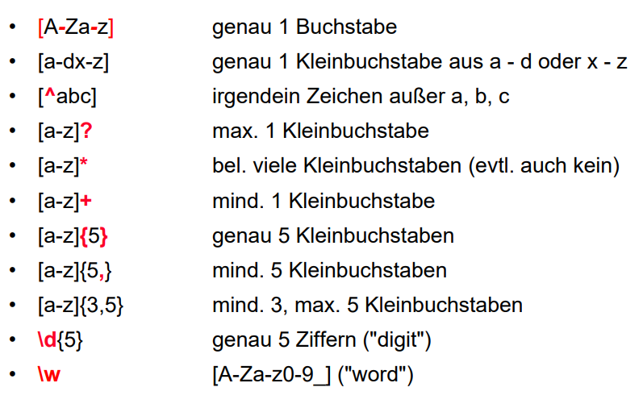

## Kotlin InteliJ Trivia Wissen:

* Unternehmen das IntelliJ produziert: Jet Brains, Hauptsitz: Prag
* Kotlin hersteller auch JetBrains, Korelation kotlin intelliJ
* Großteil von IntelliJ in Kotlin implementiert
* mit Kotlin weniger Kompatibilitätsprobleme mit anderen Sprachen als mit Java
* meißte Entwickler von Jet Brains in St. Petersburg
* Android empfiehlt inzwischen Apps nicht in JAVA sondern in Kotlin zu implementieren
* Kotlin ist eine Insel vor St. Petersburg (Java ist auch eine Insel)
* Switft Programiersprache für IOS große Ählichkeit zu Kotlin

## Überblick Folie 1-

* schlichter einfacher Code = weniger Fehlersuche
* nur blabla Egal

# Kapitel 1 was ist Softwarearchitektur

* als Wirtschaftsinformatiker denken wir an betriebliche Intformationssysteme, und unterstützung der einzelnen Unternehmensbereiche durch IT
* accenture eins der 3 größten Beratungsunternehmen, zusammen mit IBM Global Services, Capgemini
* Hamburger Hafe bla bla 

* zeigen BPM Hamburger Hafen

## Standardsoftware mit der eigene Software höufig gekopplt wird:

* Excel (leider)
* SAP ERP
* Cas (Computer aided sales)
* abas (SAP ERP System für kleine und mittleständische Unternehmen) in Karlsruhe

## Unterschied Excel und DB System: 

* Datenbank hat ein Schema Excel nicht
* mehre Clients auf der Datenbak möglich
* Benutzer, Gruppen, Rechte im DB System
* DB-Systeme haben Transaktionen

## Was sind Transaktionen: 

* Jede Transaktion hat begin of Transaction als Star tund Commit als Ende dazwischen Datenbankoperationen z.B SELECT FROM, UPDATE, INSERT INTO, DELETE ...
* Commit dauerhaftes abspeichern der durchgeführten Änderungen in der Datenbank
* Statt Commit auch Roll Back möglich, Rückgängig machen aller Operationen der Transaktion. Zurücksetzen der DB auf den Stand der vor Beginn der Transaktion

* noch mehr Hamburger Hafen blabla :(

## typische Programmiersprachen bei Altanwendungen in der freien Wirtschaft:

* Cobol
* Pascal
* C++
* PEARL
* Assembler (hofentlich nicht, wenn gesehen abhauen)
* Java 

* Jahr 2000 Problem, Problem mit Datumsvergleich, 99 zu 00, Komplette Umstellung nötig 

* Um Übersicht über einen Prozess zu erstellen laut Jürgen nicht immer korrektes UML nötig, die Verständlichkeit ist wichtiger

## 3 Schichtenarchitektur:

* Präsentationschicht: Darstellung der Daten und Zugriff auf die Daten, mit z.B REST, RSocker, GraphQL, gRPC, HTML-Seiten
* Anwendungskern: Implementierung der Use Cases losgeslöst von konkretem Datenbanksystem. Im englischen Service Layer oder Business Layer. Beziehung der Daten aus der Datenbankzugirffschickt und Weiterleitung der Daten an die Präsentationschicht
* Datenbankzugriffsschicht: Implementierung des Datenbankzugriffs 

## Probleme bei Monolithen:

* langsames Deployment, durch immer größere Software
* Abgrenzung der Komponenten mit zunehmender Größe immer unklarer, schwierigere Aufteileilung in Teilteams
* alle Teilkomponenten müssen gleiche Technologiebasis haben
* Schlechtere Skalierung bei zunehmender Datenmenge
* Handhabung mit IDEs wird immer schwerer bei großen Projekten
* -> immer mehr Unternehmen zerlegen ihre Server

# Domain Driven Design

* Motivation: Entwurf orientiert sich hauptsächlich an der fachlichen Logik

* Unterschied zu UML, keine graphische Darstellung.

* Ergänzung zu UML KEINE Alternative

## Aufbau DDD

## Entities

* Datenobjekte mit eindeutiger unveränderlicher Identität.
* zusäztlich kann ein Entity noch weitere Eigenschaften haben

## Aggregate 

* Aggregation (z.T auch Komposition) der einzelnen Entittys.
* Aggregate Root einzige Schnittstelle nach draußen.
* Untergerordnete Entitys sind von außen nicht direkt zugreibar.
* Aggragate sind eine transaktionale Einheit, heißt sie sind in sich atomar und konsistent

## Value Object

* kleine unveränderliche Objekte. z.B Adresse wird als unveränderliches Object statt als String implementiert

## Bounded Contect

* Abgrenzung dessen was wir betrachten wollen zum Rest
* Logische Gruppierung von zusammenhöngender Funktionalität
* jeder BC hat eigenes Domainmodell
* Bounded Context orientiert sich an den Geschäftsvorfällen
* Wenn eine neue Funktionalität zu realisieren ist wird sie innerhalb von einem BC realisiert. 
* Bounded Context = eigenes Projekt in IDE
 
 ## Repository

* Abstraktion des Persistenz-Mechanismus. 
* Über Repositorys werden Operationen auf der Datenbank ausgeführt, sodass man nich explizit SQL oder ähnliches schreiben muss sondern die Aufrufe in der Operationen mit der gewünschten Programiersprache ausführen kann.

## Service 

* Modellierung der fachlichen Logik, mit Entities, Value Objects, Repositories
* im Service selbst interresiert uns weder woher die Daten kommmen (erledigt das Reposistory) noch wie die Daten dargestellt werden
* Zustandslos das heißt Services haben keine Properties 
* Implementieurng in Spring durch annotieren der erstellten Service Klasse mit @Service

## Ziele von Microservices

* neue Funktionalität schnell bereistellen, da weniger Tests nötig als bei großen Servern

* agile Entwicklung, kleinere von einander unabhängige Teams

* ein Microservice = ein Bounded Context = eine Deployment Unit

* The Microservice archiectural style is an approach to developing a single applicateion as a suite of a small service, each running in its own process and communictaing with ligthweigt mmechanisms, often an HTTP resource API

# Reactive Rogramming und Multi-Threading

## Anforderungen an Server-Anwendungen
* Heterogene Clients müssen "bedient" werden: Smartphones, Tablets, Desktops, IoT-Geräte
* schnelle Antwortzeit
* immer Verfügbar
* Big Data, es fallen große Datenmengen an vorallem bei IoT

## Threads, Stack und Heap

* Thread: 

    * ein Thread entspricht einem Ausführungsstrang.
    * lineare Abarbeitung der Anweisungen.
    * Multi-Trhreading: paralles Ausführen der Threads
    * Mehre Threads gehören zu einem Betriebssytemprozess, all diese teilen sich den Heap
    
* Stack: 

    * jeder Thread hat genau einen Stack auf dem alle Anweisungen des Threads gespeichert werden.
    * Abarbetien nach dem Lifo Prinzip
    * Auch Referenzen auf Argumente und lokolae Variablen enthalten
    * Größe des Stacks wird beim Start des Threads bestimmt

    * Heap:

    * "Halde" , "Haufen"
    * für dynamische Speicherallokation 
    * wenn ein Thread Objekte beim Ablauf erzeugt, werden diese im Heap gespeichert
    * wenn ein Thread ein Object anlegt können alle Threads im selben Prozess auch darauf zufreifen
    * zum Schutz vor Memory Leaks Garbage Collector der nicht genutzte Objekte im Heap "collected" löscht.

## Scheduling von Threads:

* sequentielles Ausführen 1 Thread nach dem anderen
* preemptive: Timeslice, festgellegte Zeit für einen Thread, wenn ein Thread nicht fertig wird, wird der Rest ausgelagert. Es werden solange erst andere Threads ausgeführt. Danach wird der Rest des ersten Threads ausgeführt

## typische Probleme mit Threads
    
* Kontextwechsel sind teuer. 
* Ziel: mehrere Threads teilen sich ein CPU Kern
* Scheduler steuert wann Threads unterbrochen und zu einem anderen Thread gewechselt wird
* Anzahl der parallelen Threads ist durch das Betriebssystem begrenzt.

## Thread per Request und Blockierungen

* Problem:

    * Threads müssen z.B auf einen Datenbankzugriff, einen xternen Sevices oder ein ERP-Service warten und blockiern solange Ressourcen
    * bei vielen Threads führt das zu einer immensen Hauptspeicheranforderung
    * auch C10K Problem: 10000 Clients, 2 MB pro Stack = 20 GB Hauptspeicher nur für Thread-Management aber während ein Thread blockiert ist keine Nutzung des CPUs sondern nur Belegung des Hauptspeichers = Ressourcen Verschwendung

* Lösung: 
        
     * in Kotlin werden statt Threads Corotinen gestartet, deutlich effinzienter  als Threads.
    * Wenn ein Request abgesetzt wird kein eigenener Thread gestartet, sondern es gibt einen Request Handler der sich um die Requests kümmert.
    * der Request Handler nimmt Anfragen entegegen und startet durch einen magischen Algoritmus nur so viele Threads wie gerade notwendig sind und steuert die Ausführung der Threads
    * die Worker Threads sarten den Aufruf warten aber nicht auf das Ergebniss und ein freier Threads aus dem Thread-Pool nimmt das Ergebniss später an und leitet es an den Request Handler weiter
    * führt zu besserer Skalierung da weniger Threads benötigt werden, aber etwas höheren Aufwand für das Thread-Management.
    * Verstehen zusammen mit 1-architektur Folie 34, 35
    * Kotlin macht thread Management automatisch durch das Stichwort suspend vor einer Funktion.

* um nicht blockierend zu coden benötigt man Reactive Programming

    * bei C# durch RX.Net
    * bei JavaScript durch RxJS
    * bei Java durch RxJava oder Project Reactor oder Fibers ab Java 14
    * bei Kotlin durch Coroutines

## Was ist Reactive Programming

* auf Ergeignisse reagieren anstatt den Ablauf zu steuern
* Streaming von Events funktionales verarbeiten der Events

* Ziele: 
    * nicht blockiernd vorallem bei Zugriff auf externe Ressourcen
    * sehr viele Request gleichzeitig bedienen
    * Vorkehrung zum Umngang mit Überlast. Heißt Umleitung im Überlast Fall auf z.B einen anderen Server.

##  Nur noch Reactive Programming ? 
 
* mit Sicherheit nicht
* es gibt viele Anwendungen bei der imperative Programmierung funktioniert, warum also umstellen solange keine Skalierungsprobleme aufterten.
* imperative is simple until it is not.

# Codequalität

* gute selbesterklärende Namen 
* angemessene Kommentare (am besten keine sondern Code selbserklärend aber nicht umsetzbar)
* einheitliche Formatierung
* sinnvolle Schachtelung

# RESTful Webservices und Reactive Programming

* Bei Rest werden die HTTP-Methoden verwendet um auf Ressourcen zuzgreifen

## Motivation

* Wie ewrden Schnittstellen angeboten so das alle Gräte zugreifen können oft wird dafür Rest gewählt

* Viele große Unternehmen nutzen Rest z.B Facebook, Google, Ebay, reddit

## REST im Überblick

* HTTP-Methoden auf CRUD und Sql abbilden

    * GET = Read = SELECT
    * POST = Read = INSERT
    * PUT/PATCH = Update = UPDATE
    * DELETE = Delete = DELETE

## URI Universal Ressource Identifier

* Eindeutige Bezeichnung für eine Ressource

* Bestandteile einer URI
    
    * Schena z.B http oder https
    * Rechnername oder IP Adresse
    * Port 
    * Pfad 

## Was ist REST

* REpresentional State Transfer

* Architekturstil aber kein Standard

* Verwendete Standards

    * URIs zur Identifikation von Ressourcen
    * Zugriff auf URIs mit den HTTP-Methoden
    * MIME Typen
    * JSON
    * ...

* Repräsentation von Objekten

    * Datenaustausch zwischen Client und Server
    * vor allem JSON und binäre Dateien (Bilder, Videos)

* Zusatandslose Kommunikation

## Zusammenspiel von Client und Server

* Der Client sendet im Request Header den MIME Typ mit welcher angibt in welchem Format er die Daten haben möchte. z.B accept = application/json

* Der Server sendet im Response Header den MIME Typ mit welcher angibt in welchem Format der Body ist. z.B. content-type = application/json

# JSON mit Jackson

## JSON im Überblick

* Java Script Object Notátion

* Es werden Objekte in JavaScript representiert 

* Als Austauschformat leichtgewichtiger als XML

* geschweifte Klammern für Datensätze

* eckige Klammern für, Listen, Array, Mengen ...

* überprüfen von JSON Datensätzen mit jsonlint.com

* hierachische Struktur, keime Rückwertsverweise möglich

## Jackson

* Konvertierung von JSON Objekten zu Kotlin Objektem und umgekehrt

* Jackson konvertiert erstmal alle Properties in Kotlin zu JSON und umgekehrt, wenn man nicht möchte das eine Property von Jackson konvertiert wird muss man diese mit @JsonIgnore annotieren. Convention over Configuration

* unterstützte Typen durch Jackson in Kotlin

    * String
    * int, Loong
    * (Float, Double) 
    * Boolean

* Abblidung von Enums: 

## MIME-Typen

* Mutlipurpose Internet Mail Extensions

* gibt an in welchem Format die Übertragen Daten habe

* BSP: application/json, text/plain, text/html, image/... , video/...

# Reactive Programming und Corotinen

## Reactive Manifesto

* Message Driven: Reaktion auf asynchron eingehende Nachrichten

* Elastic: Reaktion auf wechselnde Last d.h. Skalierbarkeit

* Resilient: Reaktion auf Ausfälle z.B durch Replikation

* Responsive: Reaktion auf Requests der Clients bei kurzer Antwort und hoher Verfügbarkeit

## Backpresure

* Wenn zu viele Request eingehen soll der Server mit dieser Last umgehen können

* dazu abonniert der Subscriber nur bis zu einer Obergrenze und der Publisher produziert nur bis zu einer Obergrenze 

* wenn zu viele Requests kommen werden diese Anfragen entweder zurückgewiesen oder noch besser auf andere Server weitergeleitet

## Reactive Streams

* entwickelt von Netflix, Oracle ,Red Hat, VMware Tanzu, Twitter, ..

* Ziel: everything is a stream and its observable

* 4 Interfaces für funktinalen Programmierstil 

* Umgesetzt z.B. in RxJava von Netflix oder Project Reactor von VMware Tanzu

## Coroutinen von Kotlin

* leichtgewichtige Threads in Kotlin

* Ziele: 

    * eine Funktion soll suspendierbar sein das heißt sie kann unterbrochen und später wierder fortgesetzt werden.
    * ohne Blockierung eines Threads bei Pausierung der Funktion
    * nich blockierender Code soll möglichst einfach sein

* Coroutinen laufen mit einem Pool von Threads

* In einem Thread können mehrere Coroutinen laufen

* Datentyp für Streams ist Flow

* Implementierung im Package kotlinx.coroutines

* Bsp: 

# Rest mit Spring WebFLux.fn

## Router für "Functional Enpoints"

* Der Router bildet die Requests auf die Funktionen des Handler ab mit Router DSL.

* Spring WebFlux.fn stellt functions für den Router.

* Router ist eine Single Expression Funcion die Funktion co Router wird zrückgegeben

* coRouter ist eine Higher Order Function(Ihm gefällt HOF ausgesprochen gut)

* co seht für Coroutinen, heißt ein Router ist eien Funktion von Spring die Coroutinen verwendet

* nach coRouter Lambda Ausdruck

* in co Router wird die Funktion accept aufgrufen auf dem Ergebniss dieser Funktion wird die Funktion .nest aufgerufen

* Semantik accept: der Server nimmt einen Request entgegen welcher den MIME Typ hal+json haben soll. (HAL_JSON wird statt Mime-Typ verwendet, Konstante besser als der String da Fehler in der Variablen leichter erkennbar sind ,eine falsche Konstante wird vom Compiler erkannt. Daher wenn Konstanten vorhanden diese auch verwenden.)

* in der Funktion nest wird die Funktion GET aufgerufen

* GET hier bewusst in Caps damit man Bezug zur HTTP-Methode versteht

* Semantik GET erstes mal: wenn ein get request mit basis Pfad /api eingeht und der Client hal+json möchte dann wird vom handler die find Funktion aufgerufen.

* Semantik GET zweites mal: wenn der Basispfas api/ID ist wird vom handler die Funktion findbyid aufgerufen, der Rest gleich wie beim ersten get request

## Handler

* der Handelr leitet die Requests die er vom Router bekommt und leitet diese an Funktionen des Service weiter

* Handlerfunktionen sind suspendierbar sodass das sie unterbrochen werden können, falls es zu Blockierungen käme

* Annotiert mit @Component, Annotationen, Dependency Injections werden in Kapitel 3 geanauer besprochen

## Mock-Klasse für den Anwendungskern

* Service Klasse die Datenbankaufrufe starten soll bisher im ersten Beispiel aber nur so tut als würde es eienen Datenbankzugriff geben

* service Klasse mit @Service annotiert, Spezialfall von @Component

## Muster für Pfade

* /api/t?st: das Fragezeichen steht für genau ein Zeichen

* /api/*.png passt zu allen . png-Ressourcen passt stern bedeutet beliebig viele Zeichen

* /api/** passt zu allen Ressourcen unterhalb von Pfad /api. ** heißt also hier kann beliebig viel stehen auch wenn noch ein oder mehr mal der Pfad gewechselt wird.

* /api/{file} das selbe wie api/* aber man speichert den Inhalt in der Variable file

* /api/{file:\w+} das selbe wie api/{file} aber die möglichen Zeichen werden durch den regulären Ausdruck w+ eingeschränkt. w+ durch jeden regulären Ausdruck ersetzbar

* /api/{*path} das selbe wie /api/{file} aber es kann nicht es kann beliebig oft das Verzeichnis gewechselt werden nach /api

## Reguläre Ausdrücke

* gelten für alle gängigen Programiersprachen

## Query-Parameter

* /api?variablenname=Wert&variabelenname2=Wert2

* Query Parameter für leichtere lesbarkeit Pfad Parmeter wenn es möglichst kurz sein soll

## Response-Header

* Im Response-Header stehen die Metadaten

* das heißt der Statuscode, die URI, Versionsnummern, Datetime, Versionsnummern, Etag, Anzahl bytes des Bodys

## HTTP-Statuscodes

* 200 OK

* 201 CERATED

* 204 No content

* 304 Not Modified

* 400 Bad Request

* 401 Unauthorized , nicht eingeloggt falsches Passwort

* 403 Forbinden , zwar eingeloggt aber fehelende Berechtigung

* 404 Not found

* 409 Conflict

* 412 Precondition failed

* 428 Precondition required

* 500 internal server error

* 501 not yet implemented

## HATEAOS

* Hypermedia as the Engine of Application State

* Ziel: Ein JSON-Datensatz enthält selbsterklärende URIs

* Atom-Links: URIs im Rumpf des HTTP-Response

* Link-Header: URIs im Header des HTTP-Response

* Spring HATEOAS nutzen wir schreibt automatisch URIs als Atom-Links in den Rumpf des Response 

    ### Transitional Links

    * "IANA Link Relations" Namnen die Funktion der URIs beschreibt

        * self, die Bestellung selbst nochmal anzeige GET
        * list: alle Bestellungen auflisten GET
        * add: neue Bestellung anlegen POST
        * update: die Bestellung ändern PATCH
        * remove: die Bestellung löschen DELETE

    * Man kann auch eigen Namen für Links definieren und diese verwenden

## RMM ("REST Maturiy Model")

* Level 0: HTTP als Transportprotokoll, XML für den Datenaustausch

* Level 1: URIs für Ressourcen, HTTP-Methode POST

* Level 2: HTTP-Methoden als Verben zuzüglich Statuscode

* Level 3: HATEOAS 

## Spring HATEOAS

* Wir injezieren in den Handler ein Objekt der Klasse KundeModelAssembler die das Kotlin Objekt um die Atom-Links ergänzt und am Ende neu baut

* Die KundeModelAssembler Klasse ist von einem Interface von Spring abgeleietet welches die Funktionalität zum Erstellen des benötigten Model bereitstellt    

## Grundlegende Eigenschaften von Spring WebFlux.fn

* Roter Function Routing gmäü des
    
    * des benutzten Pfades 
    * MIME-Types
    * zur jeweiligen Handler-Function

* Handler Functions:

    * Verarbeitung eines Requests-Objekts
    * Befüllen eines Response-Objekts

* in erster Line ein funktinonale Scjmittstelle statt Annotationen

* außerdem reactive durch Coroutinen

## Spring WebMVC

* imperatives equivalent zu Spring WebFlux

