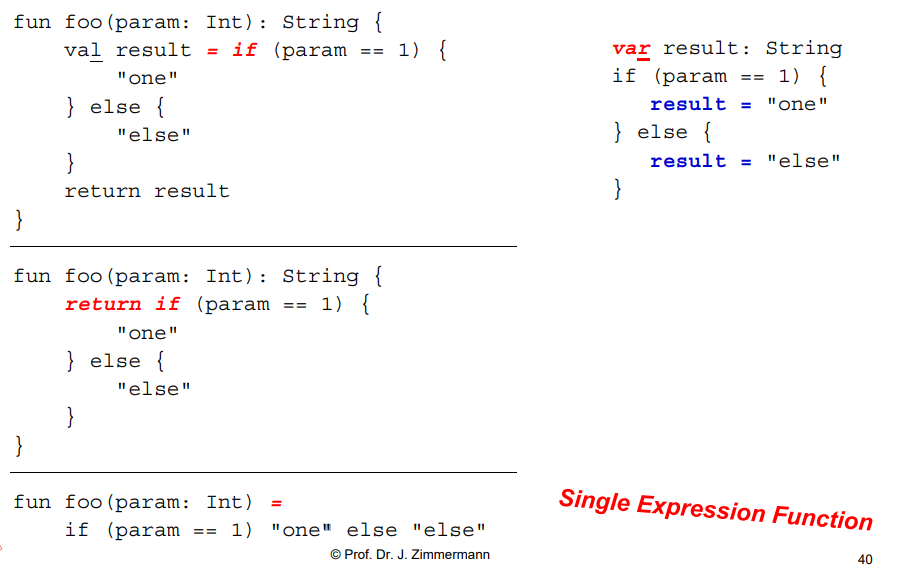
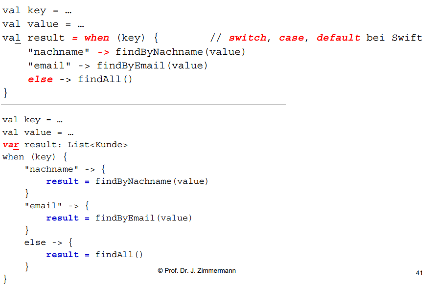
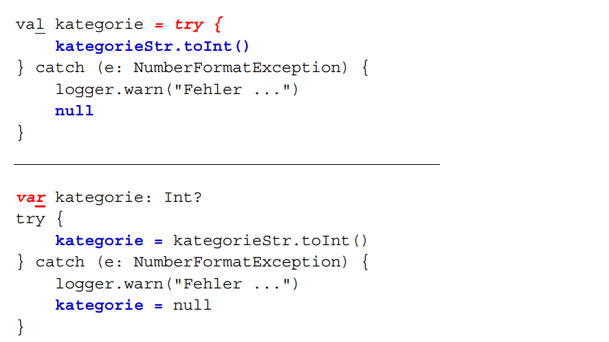
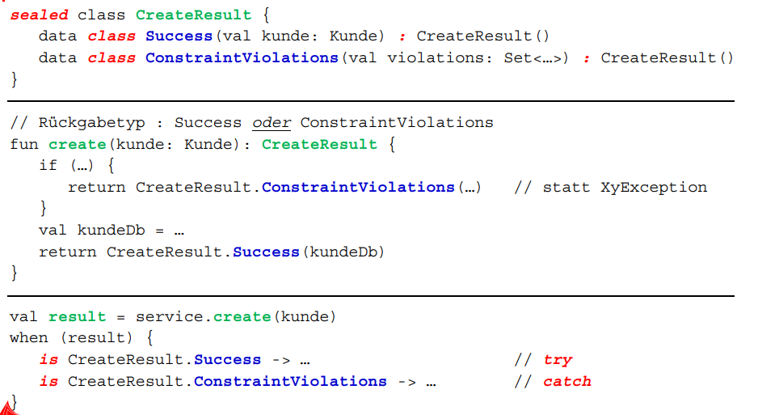

* Anfang nur Folienzusammenfassung, leider erst ab Minute 20 die Vorlesung aufgezeichnet

# Kotlin

## Objektorientierung

* Alles ist ein Objekt

* Objekte kommunizieren miteinander durch das senden und empfangen von Nachrichten

* Jeds Objekt hat einen eigenen Speicher

* Jedes Objekt ist eine Instanz einer Klasse

* Die Klasse ist der Bauplan wie der beschreibt wie die einzelnen Objekte aufgebaut sind

## Funktionale Programmierung 

* Funktionen können auch andere Funktionen als Argunmente oder Rückgabewerte haben

* higher-order-funtion: Funktion die andere Funktion(en) als Argument oder als Rückgabewert hat

* pure functions: 

    * bei gleichem Eingabewert liefert die Funktion immer den selben Rückgabewert
    * haben keine Seiteneffekte
    * Bsp: Berechnung der Mehrwertsteuert zu einem Betrag
    * Gegenbsp: einlesen des Inhalts einer Datei

* oft immutable state

## Ziele von Kotlin

* Readability: wenig und leicht verständlicher Code

* Reuse: enfache Nutzung von  (Fremd)-Bibliotheken

* Ineroperability: mit anderen Programmiersprachen wie Java, Swift, c, JavaScript

* Robuster Code: Wenig fehleranfällig, z.B. Kotlin ist Nullsafe bis man deklariert das der Wert null angenommern werden kann

* gute Werkzeugunterstützung: InteliJ, Android Studio, Gradle Kotlin DSL, Eclipse. Soll mit möglichst vielen Entwicklungsumgebungen kompatibel sein

## Vorteile von Kotlin

* Typen sind Nullsafe 

* Es werden Properties genutzt anstatt get und set Methoden

* String-Interpolation statt Strin-Konkatenation mit + 

* "Type Inference" bei val und var, Compiler erkennt implizit den Typ einer Variablen am Konstruktor

* "Higher-order-Functions" mit Lamda-Ausdrücken und funktionale Programmierung

* stattt zu veerben kann neue Funktionalität mti "Extension Functions" nachträglich zu Klassen hinzugefügt werden

* Value Object durch "data classes" mit impliziten Methoden equals, hashCode,copy und toString

* "Smart casting"

* let statt if (x!=null)

* if, when und try catch sind Ausdrücke und keine Anweisungen heißt man kann ihnen durch ein Gleicheitszeichen direkt Werte zuweisen

* Singelton  Klassen durch "object"

* Campanion-Klasse und kein "static"

* Klassen sind final

* "Named Arguments/Parameter" statt Builder-Pattern

* Destructuring

* Sealed Classes statt Exception-Handling

* "Coroutines" für asynchrone Programmierung

* Interoperalität mit Java

## Schreibweisen

* CamelCase

* snake_case

* SCREAMING_SNAKE_CASE

* kabab-case

## data class

* Properties mit val oder var

* bei data classes werden die Funktionen toString, equals, hashCode und copy automatisch generiert

## Singeltons

* Klassen von denem es nur ein einziges Objekt geben kann

## Type aliases

* vor Klassen können Parameter als alias für eienen Typ definiert werden so kann für diesen Typen dann in der Klasse der Name des Parameters verwendet werden

* macht Code lesbarer, z.B kann man dann in der Klasse Kunde statt UUID KundeId schreiben

## Copanion object

* dediziertes Singleton 

* Singelton das in einer Klasse definiert wird und quasi der "Kompanion" dieser Klasse ist. (anstatt static verwendbar).

* steht typischer Weise am Ende der Klasse

## If Anweisungen als Ausdrücke

* if Ausfrücke können nach einem Gleichheitsziechen stehen

## Statt when Anweisungen Ausdrücke

* when Ausdrücke können nach einem Gleichheitszeichen stehen

* Bsp:

## try-catch Ausfrücke

* try-catch Ausdrücke können nach einem Gleichheitzeichen stehen

* Bsp:

## Sealed Class statt Exception Handling

* sealed Class verschlossen nicht erweiterbar

* es werden Klassen definiert die exception darstellen sattt in try-catch blöcken exceptions zu werfen

* Bsp:

